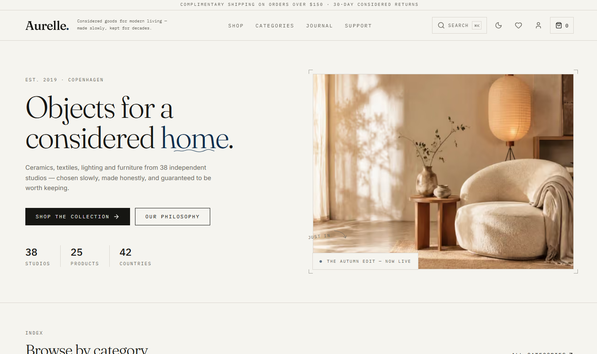

# Aurelle
                   
Live : [https://kimi-k3-ecommerce-storefront.vercel.app/](https://kimi-k3-ecommerce-storefront.vercel.app/)

           



            
         
A small, considered ecommerce storefront for handcrafted home goods — ceramics, lighting, textiles, and other quiet objects. Built as a fully server-rendered **Next.js 16** app with a complete SEO layer, a local-first shopping bag, and editorial content woven into the catalog.

## Tech stack

- **Next.js 16.3** (App Router, Turbopack) + **React 19** + **TypeScript**
- **Tailwind CSS 3.4** with a custom design-token theme (light + dark)
- **Framer Motion 13** for page transitions and scroll reveals
- **next/image** for AVIF/WebP responsive images, **next/font** for self-hosted fonts (Inter, Fraunces, IBM Plex Mono)
- **Radix UI / shadcn-style** primitives, **sonner** toasts, **cmdk** command palette, **lucide-react** icons
- All catalog/content/account data is mock data in `src/data/` — no backend. Bag, wishlist, and recently-viewed trail persist in the visitor's browser via `localStorage`.

## Getting started

```bash
npm install
npm run dev      # develop at http://localhost:3000
npm run build    # production build (standalone output)
npm start        # serve the production build
```

### Docker

```bash
docker build -t aurelle .
docker run -p 3000:3000 aurelle
```

The Dockerfile is a three-stage build producing a minimal standalone server (`server.js`) on port 3000.

## Pages

All 15 routes are statically generated at build time (66 pages total) and serve real HTTP status codes — unknown URLs return a true 404.

| Route | Page | What's on it |
|---|---|---|
| `/` | Home | Full-bleed hero, category index, featured-products grid, philosophy/story section, journal teasers, newsletter block |
| `/products` | Shop index | All 25 products with category filtering, sorting, and grid/list presentation |
| `/products/[productId]` | Product detail | Image gallery with thumbnails, price, rating, stock state, quantity picker, add-to-bag / wishlist, accordion details (materials, dimensions, care, shipping), verified customer reviews, related products, breadcrumb |
| `/categories` | Category index | All 12 departments with imagery, taglines, and piece counts |
| `/categories/[categoryId]` | Category detail | Category hero with description, filtered product grid, breadcrumb |
| `/content` | Journal | Editorial index — 12 essays with tags, read times, and imagery |
| `/content/[postId]` | Essay | Long-form article with drop cap, pull quotes, author line, and a **Shop the story** rail of the products featured in the piece |
| `/support` | Support hub | Routes to contact, returns, and FAQ |
| `/support/contact` | Contact | Contact form with topic picker and expected response times |
| `/support/returns` | Returns | Return policy, step-by-step process, and exchange notes |
| `/support/faq` | FAQ | Grouped accordion of common questions (orders, shipping, returns, care) |
| `/cart` | Bag | Line items with quantity steppers and remove, order summary (subtotal, shipping, tax), free-shipping progress hint (complimentary over $150), empty state |
| `/checkout` | Checkout | Four-step flow — Information → Delivery → Payment → Review — with progress indicator, validation, and an order-confirmation screen with barcode |
| `/account` | Account | Tabbed profile: orders with expandable line detail, saved addresses, profile details |
| `/wishlist` | Wishlist | Saved pieces with move-to-bag actions and empty state |

## Features

### Commerce

- **Shopping bag** — add from any product card or detail page, adjust quantities, remove lines; totals computed live with free-shipping threshold ($150) and tax
- **Wishlist** — one-tap save/unsave everywhere a product appears
- **Recently viewed trail** — product visits are recorded and resurfaced
- **Mock checkout** — full multi-step flow ending in a confirmed order id; orders and account data are fixtures in `src/data/account.ts`

### Experience

- **Command palette search** — `⌘K` / `Ctrl+K` (or the search icon) opens instant search across products, categories, and essays
- **Light/dark theme** — light is the default regardless of system preference; a pre-paint script applies a saved dark choice before first paint, so there's no flash
- **Motion** — enter transitions per route (`app/template.tsx`), scroll-triggered reveals, item-level (never grid-level) stagger animations, image fade-ins with pulse placeholders and a hydration-safe load hook
- **Details** — barcodes, ornaments, drop caps, label-mono microcopy, editorial serif display type, generous hairline rules
- **Hydration-safe persistence** — bag/wishlist/trail load after mount and pages render skeletons until ready, so server and client HTML always match
- Toasts for bag/wishlist actions; keyboard- and screen-reader-friendly primitives throughout

### SEO

- **Per-page metadata** — unique titles (`"%s — Aurelle"` template), descriptions, canonical URLs, Open Graph and Twitter cards with images; article pages use `og:type="article"` with publish dates and authors
- **Structured data (JSON-LD)** — Product (offers, price, availability, aggregate rating), Article, FAQPage, CollectionPage + ItemList, BreadcrumbList, Organization + WebSite
- **Discovery** — `sitemap.xml` covering every public route, `robots.txt` referencing it
- **Noindex** on bag, checkout, account, and wishlist so thin/private pages stay out of search results
- **Performance as SEO** — responsive AVIF/WebP images with priority loading above the fold, self-hosted variable fonts with no layout shift, full static pre-rendering
- Site URL lives in one place (`SITE_URL` in `src/lib/seo.ts`) — change it when deploying to a real domain

## Project structure

```
app/                        # App Router: routes, layout, template, sitemap, robots, icon
  layout.tsx                #   fonts, global metadata, theme script, providers
  template.tsx              #   per-route enter transition
  products/[productId]/     #   generateStaticParams + generateMetadata + JSON-LD
  ...                       #   one thin server wrapper per route
src/
  components/pages/         # client page bodies (rendered by the route wrappers)
  components/               # Header, Footer, SearchPalette, ProductCard, FadeImage, JsonLd, ornaments
  components/motion/        # reveal/motion primitives
  store/                    # ShopContext (bag, wishlist, trail), ThemeContext
  data/                     # catalog.ts (25 products, 12 categories, reviews),
                            # content.ts (12 posts, FAQs, shop-the-story map),
                            # account.ts (orders, addresses, profile)
  lib/seo.ts                # site config + all JSON-LD builders
  hooks/                    # use-image-loaded (SSR-safe image load state)
public/images/              # generated imagery: products, categories, posts, hero
```

## Notes

- **No real backend** — nothing is saved server-side; the bag, wishlist, and browsing trail live only in the visitor's browser. Checkout does not process payments.
- All product, review, journal, and account data is illustrative mock content meant to be replaced with a real catalog.
